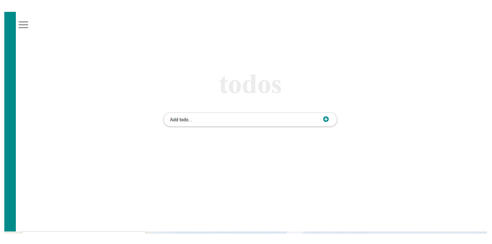

# To Do App using React

> This is a web App todo list using reactJs that displays a list of to-do activities and allows the user to add, remove, and update functionality.


### ScreenShoot



## Built With

- HTML
- CSS 
- JavaScript 
- React
- Linters
- Vscode


## Getting Started

To get a local copy up and running follow these simple example steps.

### Prerequisites

- Node and NPM
- Web browser (Google chrome)
- Code Editor (VSCode)

### Development (Running locally)

- git clone the project

```bash 
git clone git@github.com:Debas-31/to-do-app-react
```

- Install Dependencies

```bash
npm install
```

- To run StyleLint by itself, you may run the lint task:

```bash
npx stylelint "**/*.{css,scss}"
```

- Automatically fix issues found (where possible):

```bash
npx stylelint "**/*.{css,scss}" --fix
```
- To fix automatically javaScript issues found
```bash
npx eslint . --fix
```
- Finally, start your development server by running:

```bash
npm start
```

👤 **Debas Gebreslasie**

- [GitHub](https://github.com/Debas-31)
- [Twitter](https://twitter.com/DEBSH76956492)
- [LinkedIn](https://www.linkedin.com/in/debas-gebrengus)

## 🤝 Contributing

Contributions, issues and feature requests are welcome!

Feel free to check the [issues page](https://github.com/Debas-31/to-do-app-react/issues).

## Show your support

Give a ⭐️ if you like this project!

## Acknowledgments

- React Community 

## 📝 License

[MIT licensed](https://github.com/Debas-31/to-do-app-react/blob/dev/MIT.md).